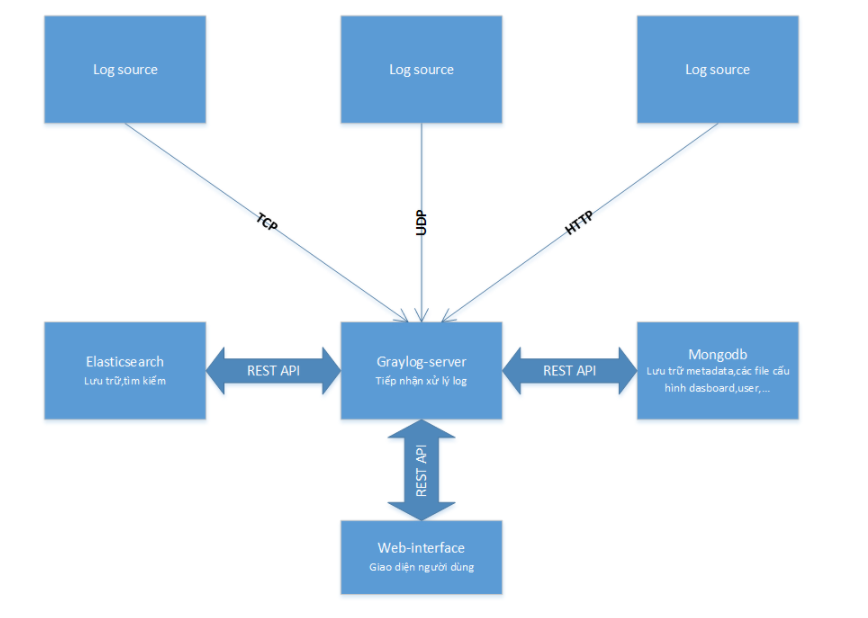
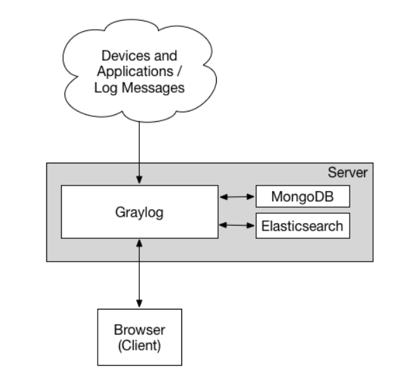
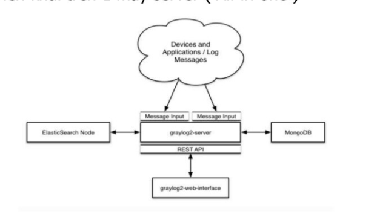
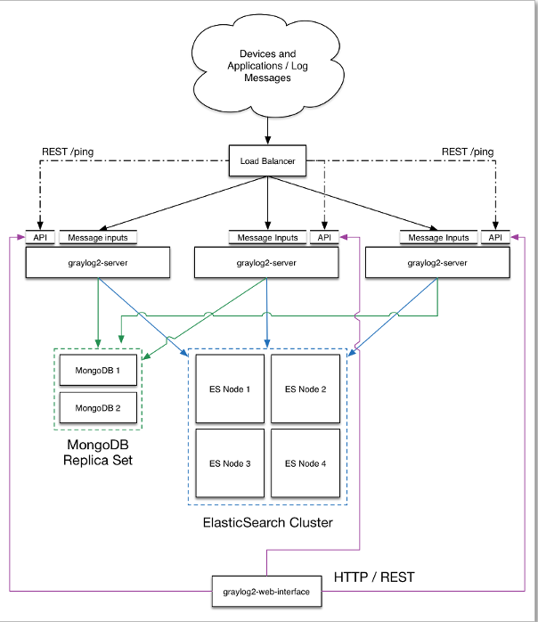
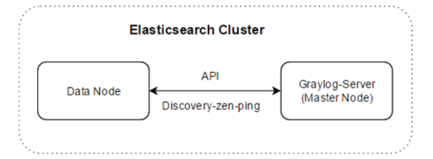
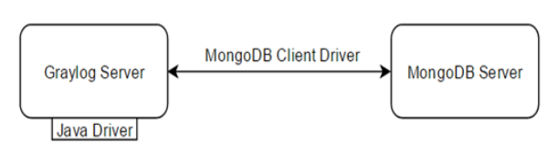

# Mục lục 
- [1. Giới thiệu về graylog](#1)
- [2. Kiến trúc graylog](#2)
  - [2.1 Tổng quan](#21)
  - [2.2 Mô hình](#22)
  - [2.3 Tương tác Graylog-server với Elasticsearch](#23)
  - [2.4 Tương tác Graylog-server vói Mongodb](#24)
- [Tham khảo](#tm)
---

# 1. Giới thiệu về graylog

- Graylog là phần mềm mã nguồn mở được tạo ra với mục đích là thu thập log có thể chạy trên linux. Nó có khả năng gộp chung và giải nén các dữ liệu quan trọng từ server log, thứ thường được gửi sử dụng giao thức Syslog.

- Link trang chủ : https://www.graylog.org/

- Graylog tạo bỏi Lennart Koopman vào năm 2010 với tên bản beta(phiên bản 0.x.x) là Graylog2

- 2/2014, phát hành Graylog2 V0.20.0 Final.

- 19/02/2015, ra mắt bản chính thức tên Graylog phiên bản 1.0.0

- Phiên bản mới Graylog nhất là v4.2 ra đời ngày 13/10/2021

- Graylog viết bằng ngôn ngữ java

- Ứng dung Graylog trong cloud computing:

  - `SSH` : Thống kê user, ip đăng nhập, số lần đăng nhập SSH thành công, thất bại, tổng số lần đăng nhập.
  - `OpenVPN` : Thống kê user, ip đăng nhập , ip được cấp VPN trên hệ thống Lab và hệ thống thực.
  - `OpenStack` : Thống kê user, số lần đăng nhập dashboard thành công và thật bại, số máy ảo được tạo, xóa, hỏng.
  - `SSH` : Thống kê `user`, `ip` đăng nhập, số lần đăng nhập `ssh` thành công, thất bại, tổng số lần đăng nhập.
  - `OpenVPN` : Thống kê `user`, `ip` đăng nhập , `ip` được cấp `VPN` trên hệ thống Lab và hệ thống thực.
  - `OpenStack` : Thống kê `user`, số lần đăng nhập `dashboard` thành công và thật bại, số máy ảo được tạo, xóa, hỏng.

# 2. Kiến trúc graylog

## 2.1 Tổng quan 

- Graylog có 4 thành phần chính là
  
  - Graylog-server: thực hiện xử lý log, kết nối ,truyền thông tới Mongodb và Elasticsearch, và quản lý Web-interface nên bị ảnh hưởng bởi CPU

  - Elasticsearch thực hiện lưu trữ tìm kiếm log nên bị ảnh hưởng bởi tốc độ I/O, RAM, tốc độ ổ đĩa

  - Mongodb lưu trữ cấu hình người dùng,metadata nên cần cấu hình thấp

  - Web-interface cung cấp giao diện trên web cho người dùng
- Trong mô hình Graylog2-server sẽ nhận log từ các log source từ các Log Source qua các giao thức mạng là TCP,UDP,HTTP

## 2.2 Mô hình 
- Mô hình thiết lập tối thiểu  

  - Đây là một thiết lập Graylog tối thiểu có thể được sử dụng cho các thiết lập nhỏ hơn, không quan trọng hoặc thử nghiệm. Không có thành phần nào là dư thừa, và chúng dễ dàng và nhanh chóng để thiết lập.

- Mô hình triển khai trên một máy (All in one)

- Mô hình triển khai mở rộng 

  - Đám mây trên cùng đại diện cho máy, ứng dụng, v.v. là mục tiêu của thu thập log và đại diện cho thông báo được gửi đến Graylog server bao gồm một số cụm thông qua Loadbalancer (bộ cân bằng tải).
  - Graylog bao gồm các cụm được thể hiện để truyền dữ liệu đến cả MongoDB Replica và ElasticSearch Cluster ở giai đoạn sau, được sử dụng làm phụ trợ lưu trữ dữ liệu. (Mũi tên xanh lá cây và mũi tên xanh lam) Và ở dưới cùng, Web Interface, cũng là một thành phần của Graylog, nằm gần quản trị viên và nó hiển thị trang tổng quan, v.v. cho người dùng hoặc thực hiện các chức năng quản lý thông qua giao tiếp với Máy chủ Graylog.

  - Loadbalancer có thể ping các  Graylog node thông qua HTTP trên API Graylog REST để kiểm tra xem chúng có còn sống hay không và đưa các nút chết ra khỏi cụm.

## 2.3 Tương tác Graylog-server với Elasticsearch

- `Graylog-server` được coi như là một `Node` trong `Elasticsearch Cluster` tương tác `Node` qua `API` cụ thể là `Discovery-zen-ping`
- Graylog-server sẽ phải khai báo như là một Node để kết nối với Elasticsearch Cluster

- Phiên bản Elasticsearch với Graylog-server

Graylog version	| Elasticsearch version
---|---
1.2.0-1.2.1|	1.7.1
1.3.0-1.3.3	|1.7.3
1.3.4	|1.7.5
2.0.0	|2.3.1
2.0.1-2.0.3	|2.3.2
2.1.0-2.1.3|2.3.5
2.2.0-2.2.3|2.4.4
2.3.x-2.4.x|2.4.x, 5.6.x
2.5.x|2.4.x, 5.6.x, 6.8.x
3.0-3.3|5,6x, 6,8x
4.x|6.8.x, 7.7.x-7.10.x

## 2.4 Tương tác Graylog-server vói Mongodb

-  `Graylog-server` tương tác với `Mongodb` theo cơ chế `client-server` với `Graylog-server` là `client` được cài `Mongodb client driver` và `Mongodb` là `server`

# Tham khảo 

https://docs.graylog.org/docs

https://github.com/letran3691/Graylog#3.1

https://github.com/hocchudong/thuctap032016/blob/master/HTHieu/BaoCaoThuTap/Graylog/BaocaoGraylog.md