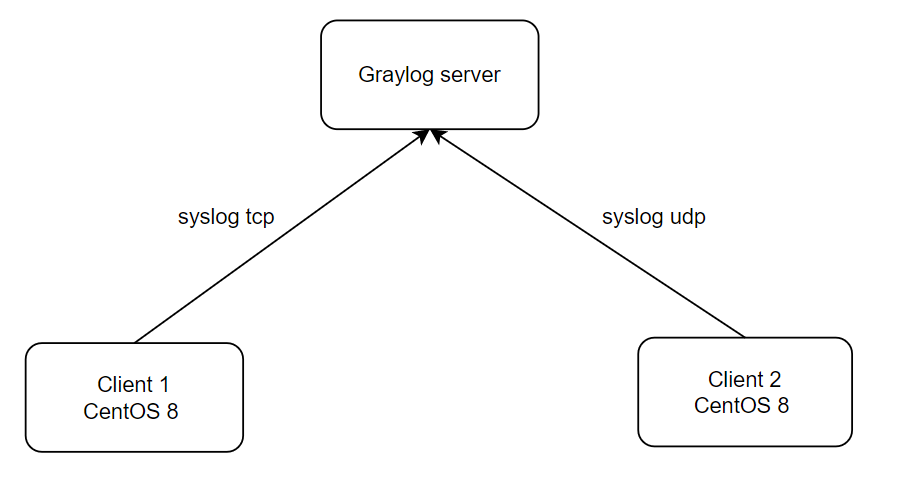

# Mục lục 
- [1. Mô hình triển khai](#1)
  - [1.1 Mô hình lab](#11)
  - [1.2 IP planning ](#12)
- [2 Cài đặt](#2)
  - [2.1 Chuẩn bị ](#21)
  - [2.2 Cài đặt java ](#22)
  - [2.3 Cài MongoDB ](#23)
  - [2.4 Cài Elasticsearch ](#22)
  - [2.5 Cài Graylog và cấu hình](#25)
- [Tham khảo](#tm)

# 1. Mô hình triển khai  

## 1.1 Mô hình lab

# 1.2 IP planning 

Name | OS | Interface | IP | Cấu hình phần cứng
---|---|---|---|---
Graylog server | CentOS 8 | ens160 | 192.168.247.139 | Ram 4Gb, 4 core
Client 1 | CentOS 8 | ens160 | 192.168.247.134 | Ram 2Gb, 4 core
Client 2 | CentOS 8 | ens160 | 192.168.247.136 | Ram 2Gb, 4 core

# 2 Cài đặt  

## 2.1 Chuẩn bị  
  - Thực hiện update và cài đặt gói bổ trợ.

            yum update -y
            yum install -y epel-release 
            yum install -y git byobu wget vim pwgen

  - Đồng bộ thời gian  
    - Cấu hình ntp trên cả máy Client và Server:

          yum install -y chrony

    - Để thời gian được đồng bộ, sửa file cấu hình /etc/chrony.conf như sau:

          server 192.168.247.139 iburst
          #server 1.centos.pool.ntp.org iburst
          #server 2.centos.pool.ntp.org iburst
          #server 3.centos.pool.ntp.org iburst

    Lưu ý: 192.168.247.139 là địa chỉ IP của ntp server trong mạng.

    - Khởi động và kích hoạt chrony:

      systemctl start chronyd
      systemctl enable chronyd

    - Kiểm tra lại đồng bộ hóa thời gian:

          chronyc sources

    - Kiểm tra thời gian hệ thống:
        
           timedatectl

## 2.2 Cài đặt java

        yum -y install java-1.8.0-openjdk-headless.x86_64

## 2.3 Cài MongoDB
  - Thêm file lưu trữ repo mongodb

        vi /etc/yum.repos.d/mongodb-org.repo
  - Nội dung file 

        [mongodb-org-4.2]
        name=MongoDB Repository
        baseurl=https://repo.mongodb.org/yum/redhat/$releasever/mongodb-org/4.2/x86_64/
        gpgcheck=1
        enabled=1
        gpgkey=https://www.mongodb.org/static/pgp/server-4.2.asc

  - Cài đặt mongoDB      

        yum install mongodb-org -y

  - Khởi động MongoDB cùng hệ điều hành và khởi động nó  ngay lập tức:

        systemctl daemon-reload
        systemctl enable mongod.service
        systemctl start mongod.service
        systemctl --type=service --state=active | grep mongod

## 2.4 Cài Elasticsearch 
  - Cài đăt khóa Elastic GPG

        rpm --import https://artifacts.elastic.co/GPG-KEY-elasticsearch

  - Thêm file lưu trữ repo 
 
        vi /etc/yum.repos.d/elasticsearch.repo

  - Nội dùng file 

        [elasticsearch-7.x]
        name=Elasticsearch repository for 7.x packages
        baseurl=https://artifacts.elastic.co/packages/oss-7.x/yum
        gpgcheck=1
        gpgkey=https://artifacts.elastic.co/GPG-KEY-elasticsearch
        enabled=1
        autorefresh=1
        type=rpm-md

  - Cài đặt elasticsearch

        yum install elasticsearch-oss -y

  - Sửa đổi file cấu hình Elasticsearch (/etc/elasticsearch/elasticsearch.yml) và đặt cluster.name thành `graylog` và `action.auto_create_index: false` để kích hoạt hành động

        cluster.name: graylog
        action.auto_create_index: false
      

  - Khởi động Elasticsearch 

        systemctl daemon-reload
        systemctl enable elasticsearch.service
        systemctl restart elasticsearch.service
        systemctl --type=service --state=active | grep elasticsearch
  - Kiểm tra 

        [root@localhost ~]# curl -X GET http://localhost:9200
        {
         "name" : "localhost.localdomain",
         "cluster_name" : "graylog",
         "cluster_uuid" : "H-zJTFohTyG4VsfWR_pkRg",
         "version" : {
          "number" : "7.10.2",
          "build_flavor" : "oss",
          "build_type" : "rpm",
          "build_hash" : "747e1cc71def077253878a59143c1f785afa92b9",
          "build_date" : "2021-01-13T00:42:12.435326Z",
         "build_snapshot" : false,
         "lucene_version" : "8.7.0",
         "minimum_wire_compatibility_version" : "6.8.0",
          "minimum_index_compatibility_version" : "6.0.0-beta1"
         },
         "tagline" : "You Know, for Search"
        }

## 2.5 Cài Graylog và cấu hình 
  - Cài cấu hình repo graylog và cài graylog

        rpm -Uvh https://packages.graylog2.org/repo/packages/graylog-4.2-repository_latest.rpm
        yum -y install graylog-server 

  - Sửa file cấu hình /etc/graylog/server/server.conf. Cần thêm `password_secret` và `root_password_sha2` và http_bind_address = IP:9000

    - Tạo secret key: pwgen -N 1 -s 96

            [root@localhost ~]#  pwgen -N 1 -s 96
            hf2Lzfh0E0tuYT6npijHRZK5ZeLvGlUiCkgyrHFfdFc5aMTXB7Fgodjf1wXezGq4PcSHONb179TLGgJt5IjezDEtbIOe0cfr

    - Tạo password: 
    
            echo -n your-password | shasum -a 256
            116c1c9673d931c252afd4147396912e793125538880b4d3d4cad88c2968df9f
      hoặc 

            echo -n "Enter Password: " && head -1 </dev/stdin | tr -d '\n' | sha256sum | cut -d" " -f1
            Enter Password: 
            116c1c9673d931c252afd4147396912e793125538880b4d3d4cad88c2968df9f

    - Sử dụng password để đăng nhập trên web interface

    - Thêm địa chỉ truy nhập cổng 9000

            http_bind_address = 192.168.247.142:9000
    - Chỉnh timezone 

            root_timezone = Asia/Ho_Chi_Minh

      

  - Khởi động graylog 

            systemctl daemon-reload
            systemctl enable graylog-server.service
            systemctl start graylog-server.service
            systemctl --type=service --state=active | grep graylog

- Nếu sử dụng SELinux 
  - Cho phép máy chủ web truy cập mạng

        setsebool -P httpd_can_network_connect 1
  - Hoặc cho phép truy cập vào từng cổng riêng lẻ 

    - API Graylog REST và giao diện web:
    
            semanage port -a -t http_port_t -p tcp 9000
    - Elasticsearch (chỉ khi API HTTP đang được sử dụng):
    
            semanage port -a -t http_port_t -p tcp 9200

  - Cho phép sử dụng cổng mặc định của MongoDB (27017/tcp): 
        
        semanage port -a -t mongod_port_t -p tcp 27017

- Trên trình duyệt nhập http://192.168.247.142:9000 để truy cập graylog

# Tham khảo 

https://docs.graylog.org/docs/centos

https://www.atlantic.net/vps-hosting/install-graylog-monitoring-server-on-centos-8/
