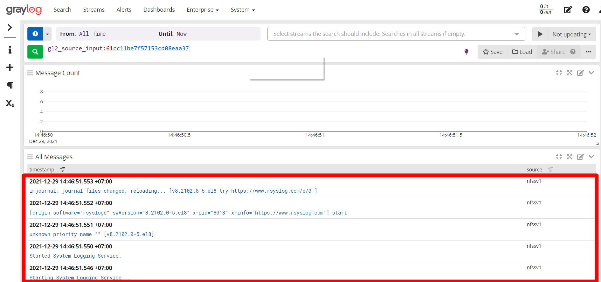

# Hướng dẫn cấu hình graylog thu thập log bằng syslog.

- Sau khi cài đặt và cấu hình graylog server, tiếp theo sẽ cấu hình client gửi log đến graylog server qua syslog 

# 1. Mô hình triển khai  

## 1.1 Mô hình lap 

## 1.2 IP planning 

Name | OS | Interface | IP | Cấu hình phần cứng
---|---|---|---|---
Graylog server | CentOS 8 | ens160 | 192.168.247.139 | Ram 4Gb, 4 core
Client 1 | CentOS 8 | ens160 | 192.168.247.134 | Ram 2Gb, 4 core
Client 2 | CentOS 8 | ens160 | 192.168.247.136 | Ram 2Gb, 4 core

# 2. Thiết lập trên client 

- Chuẩn bị  
  - Thực hiện update và cài đặt gói bổ trợ.

            yum update -y
            yum install -y epel-release 
            yum install -y git byobu wget vim pwgen

  - Đồng bộ thời gian  
    - Cấu hình ntp trên cả máy Client và Server:

          yum install -y chrony

    - Để thời gian được đồng bộ, sửa file cấu hình /etc/chrony.conf như sau:

          server 192.168.247.139 iburst
          #server 1.centos.pool.ntp.org iburst
          #server 2.centos.pool.ntp.org iburst
          #server 3.centos.pool.ntp.org iburst

    Lưu ý: 192.168.247.139 là địa chỉ IP của ntp server trong mạng.

    - Khởi động và kích hoạt chrony:

      systemctl start chronyd
      systemctl enable chronyd

    - Kiểm tra lại đồng bộ hóa thời gian:

          chronyc sources

    - Kiểm tra thời gian hệ thống:
        
           timedatectl

- Cấu hình IP và port để gửi log về graylog server
  
  - Trên client 1 sử dụng TCP 

        echo '*.*  @@192.168.247.139:10514;RSYSLOG_SyslogProtocol23Format' >> /etc/rsyslog.conf

   - Trên client 2 sử dụng UDP

          echo '*.*  @192.168.247.139:1514;RSYSLOG_SyslogProtocol23Format' >> /etc/rsyslog.conf

 - Thực hiện mở port 1514 và 10514 trên cả graylog server và clients

        firewall-cmd --add-port=1514/udp --permanent
        firewall-cmd --add-port=10514/tcp --permanent
        firewall-cmd --reload

# 3. Cấu hình syslog trên Web Interface của graylog-server

- Khai báo input cho syslog 
 

- Cấu hình cho client 1 chọn syslog TCP 

  - Thiết lập 

[1] Tên của input

[2] Địa chỉ interface, có thể đặt 0.0.0.0 hoặc địa chỉ ip graylog server

[3] Địa chỉ port sử dụng 

  - Chọn save để lưu. Đầu ra như hình là thành công 

  - log đã được ghi trên graylog server

- Tương tự cấu hình cho client 1 chọn syslog TCP 

