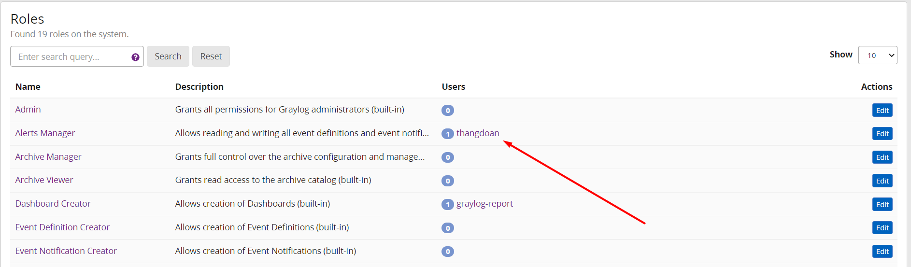

# Mục Lục
- [1. Tạo user trên graylog và cấp roles cho user](#1)
- [2. Hiểu thêm về role trên graylog 4.0](#2)
- [3. Tạo team trên graylog](#3)

# 1. Tạo user trên graylog và cấp roles cho user

- Từ trang chủ graylog chọn System --> Users and Teams 

    Tại đây ta thấy tổng quan về user mặc định trên graylog server.

- Để tạo user mới chọn Create User 

- Tại giao diện tạo người dùng mới ta bắt đầu nhập các thông tin user

  - [1] **Profile**: Tạo hồ sơ người dùng, các thông tin về tên người dùng, tên tài khoản đăng nhập, mail người dùng
  - [2] **Settings** Thiết lập thời gian phiên hoạt động, time zone. Ở đây cho phép phiên hoạt động không giới hạn thời gian
  - [3] **Roles** Quy định roles cho user, mặc định sẽ có role *reader*
 
  - [4] Password: thiết lập mật khẩu người dùng  

-  Chỉnh sửa lại thông tin, mật khẩu, vai trò user chọn Edit

- Đăng nhập gaylog server bằng user mới tạo 

# 2. Hiểu thêm về roles trên graylog 4.0

- Xem tổng quan về roles từ graylog web server chọn System --> Roles 

- Với Graylog 4.0, roles không còn xác định những thực thể mà người dùng có thể nhìn thấy, mà là những loại hành động mà họ có thể thực hiện.
- Với bản cập nhật này, người dùng hay các tổ chức không còn cần phải tạo các vai trò tùy chỉnh.

- Khi nhiều người dùng được tạo, có thể từ một role cụ thể để thêm user sử dụng role đó 
  - Từ trang tổng quan các role, chọn Edit một role cụ thể cần thêm cho người dùng 

  - Lấy danh sách user và chọn user cần gán cho role, sau đó chọn Assign User

  - Kiểm tra user đã được thêm vào roles

- List roles trên hệ thống

   Roles | Description
   ---|---
   Admin | Cấp tất cả quyền cho quản trị viên Graylog (tích hợp sẵn)
   Reader | Cấp quyền cơ bản cho mọi người dùng Graylog (tích hợp sẵn)
   Alerts Manager | Cho phép đọc và ghi tất cả các định nghĩa sự kiện và thông báo sự kiện (tích hợp sẵn)
   Archive Manager | Cấp toàn quyền kiểm soát cấu hình và quản lý lưu trữ (tích hợp sẵn)
   Archive Viewer | Cấp quyền truy cập đọc vào danh mục lưu trữ (tích hợp sẵn)
   Dashboard Creator | Cho phép tạo Dashboard (tích hợp sẵn)
   Event Definition Creator | Cho phép tạo định nghĩa sự kiện (tích hợp sẵn)
   Event Notification Creator | Cho phép tạo thông báo sự kiện (tích hợp sẵn)
   Forwarder System (Internal) | Vai trò kỹ thuật nội bộ. Cấp quyền truy cập để đăng ký và kéo các cấu hình cho người chuyển tiếp (tích hợp sẵn)
   Forwarders Manager | Cho phép quản lý người chuyển tiếp, hồ sơ đầu vào và tạo mã thông báo cho Người dùng Hệ thống Giao nhận (tích hợp sẵn)
   Report Manager | Cấp toàn quyền kiểm soát cấu hình báo cáo và đọc quyền truy cập vào dashboards và user (tích hợp)
   Report System (Internal) | Vai trò kỹ thuật nội bộ. Hệ thống báo cáo cấp cho Người dùng quyền truy cập cần thiết để tạo báo cáo (tích hợp sẵn)
   Sidecar System (Internal) | Vai trò kỹ thuật nội bộ. Cấp quyền truy cập để đăng ký và kéo cấu hình cho Sidecar node (tích hợp sẵn)
   Teams Inspector | Cho phép liệt kê tất cả các nhóm (tích hợp sẵn)
   Theme Override Editor | Cấp toàn quyền kiểm soát cấu hình và quản lý ghi đè chủ đề (tích hợp sẵn)
   Theme Override Viewer | Cấp quyền truy cập đọc vào ghi đè chủ đề (tích hợp sẵn)
   User Inspector | Cho phép liệt kê tất cả các tài khoản người dùng (tích hợp sẵn)
   Views Manager | Cho phép đọc và ghi tất cả các lượt xem và tìm kiếm mở rộng (tích hợp)
   Watchlist Editor | Cho phép thay đổi danh sách theo dõi

# 3. Tạo team trên graylog

- Teams cho phép cấp quyền và khả năng cho nhiều người dùng.
- Trang chi tiết nhóm cung cấp tổng quan về tất cả các thực thể đang được chia sẻ với một nhóm.
- Các nhóm có thể được quản lý thủ công hoặc đồng bộ hóa từ các tài nguyên bên ngoài như LDAP.
- Việc quản lý nhóm yêu cầu phải có tài khoản Quản trị viên
- Quản trị viên có thể sử dụng Nhóm như một cách để cung cấp Vai trò cho nhiều người dùng cùng một lúc, thay vì cung cấp các khả năng riêng lẻ

- Cần Graylog Enterprise license để sử dụng chức năng Team

