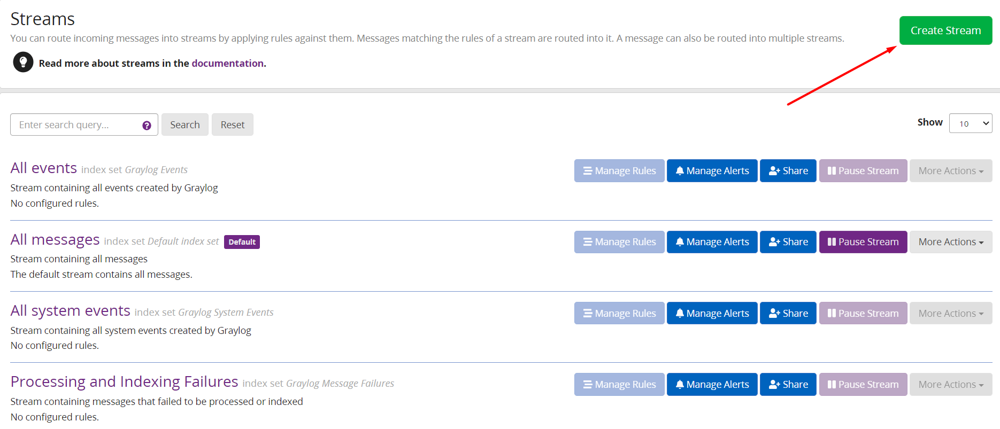

# Mục lục 
- [1. Giới thiệu](#1)
- [2 Stream](#2)
  - [2.1 Tạo stream ](#21)
  - [2.2 Tạo extractor ](#22)
  - [2.3 Tạo pattern ](#23)
  - [2.4 Quản lý extractor](#23)
- [Tham khảo](#tm)

# 1. Giới thiệu 

- Stream Graylog là một cơ chế để định tuyến các thông báo vào các danh mục trong thời gian thực trong khi chúng được xử lý
- Bạn có thể định tuyến các message đến vào các luồng bằng cách áp dụng các rule chống lại chúng. Message phù hợp với quy tắc của một luồng được chuyển vào nó. Một message cũng có thể được chuyển thành nhiều stream.

# 2.  Stream 

## 2.1 Tạo stream 

- Tại giao diện Stream chọn Create Stream

- Nhập tên và mô tả cho Stream 

- Quản lý rule cho stream SSH

    - [1] Chọn kiểu đầu vào muốn tải message

    -  [2] Chọn đầu và từ danh sách 

    - [3] Thêm rule cho stream

      - Chọn Fields
      - Chọn type
      - Nhập giá trị 
      - Save 
        
 
    - [4] Chọn nếu muốn lấy message trùng với tất cả rule 
    - [5] Chọn nếu muốn lấy message trùng với bất kì rule nào. 
    - [6] Lưu rule     
- Tại giao diện Search chọn Stream để lọc các message
        
- Chọn thời gian cần hiển thị log
        
- Kết quả lọc theo Srteam 
        

## 2.2 Tạo Extractor
- Rule Stream lấy các thông tin cần thiết bằng cách sử dụng đầu vào Fields
        

- Ngoài các Extractor có sẵn trong faild, có thể tạo thêm các Extractor để sử dụng.

- Extractor là các trường được thêm vào để lọc lấy 1 số thông tin nhất đinh từ bản tin như: user, ip, port...

**Tạo Extractor**

- Bước 1
  - Chọn 1 bản tin mẫu và extractor tạo ra sẽ lọc những thông tin với những bản tin có cú pháp tương tự như bản tin mẫu :
        

- Bước 2 
  - Chọn extractor là grok pattern và chọn Submit
        

  - Ta sẽ được chuyển đến giao diện như sau:
        

    - Trong đó 

    [1] Chỉ ra rằng message này đẩy qua input có tên Systemctl udp,và nó cũng là chỉ ra nơi quản lý Extractor này.

    [2] Mẫu message được sử dụng 

    [3] Tích nếu chỉ muốn hiển thị các pattern được đặt tên

    [4] Nơi viết grok pattern 

    [5] Nơi chứa các pattern có sẵn có thể sử dụng 

    [6] Kiểm tra đầu ra qua mẫu message

    [7] Đặt tên cho extractor

- Bước 3 
  - Điền các trường thông tin. Ở đây tôi lấy thông tin ip và port bằng pattern được tạo thêm (sẽ giới thiệu phần sau)
        

  - Extractor được tạo 

    
- Bước 4: Kiểm tra 
  - Extractor mới ra được thêm vào log message 
    

## 2.3 Tạo pattern  
- Vào System/Grok Patterns, tại đây sẽ hiện ra cửa sổ quản lý các mẫu grok.
    
- Chọn create pattern để tạo pattern mới hoặc Import pattern file để chọn pattern có sẵn trên máy. Ở đây tôi tạo pattern IP_PORT đã sử dụng trước đó. Chọn Save  để lưu
  

- Pattern được tạo đã được thêm vào danh sách có sẵn  
  

## 2.4 Quản lý extractor
- Để quản lý các Extractor đã tạo, ta vào System/Inputs. Tại đây sẽ có các loại Input, bấm Manage Extractor để quản lý Extractor cho từng loại đầu vào (Input).

  
- Tại đây ta có thể chỉnh sửa các Extractor, xóa hoặc tải lên 1 Extractor sẵn có.
  
- Để Import hoặc Export các Extractor, ta có thể kích vào Actions, sau đó có thể chọn Import extractors hoặc Export extractors
  

# 3. Phân tích log 

- Có thể phân tích 1 dòng log ra chi tiết bằng cách sử dụng Grok Pattern 

Ví dụ phân tích dòng log `Accepted password for root from 192.168.247.1 port 65043 ssh2`

  

Dòng log được phân tích thành các extractor được hiện thị như trên. 

- Qua stream có thể lọc log qua các rule được thêm vào  

  

  - Hình trên có 2 rule được được thêm vào stream level và tích vào vị trí thư 2. Điều này có nghĩa các message gửi về sẽ được log qua stream và hiển thị log trùng với 1 trong các rule được thêm. 
  - Để hiển thị message thỏa mãn cả tất cả các rule được thêm ở trong stream tích vào vị trí 1. 

  - Ví dụ hiện thị message được gửi về được lọc qua Stream level trong thời gian 1 giờ trước.
  

- Hiển thị các message có extractor cần thiết 
  

  - Các giá trị extractor và số lượng message được hiển thị  
  
  - Xem các message được gửi của một extractor 
  
  - Kết quả  
  

# Tham Khảo 

https://github.com/hocchudong/ghichep-graylog/blob/master/docs/graylog-v4/docs/7.Config_grok_pattern_in_graylog.md

