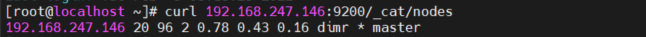
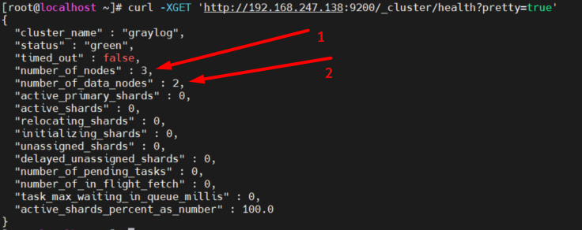

# Sử dụng elacticsearch cluster với 1 es-master
- Mô hình 


- Bước 1 Cài mongodb 
- Bước 2 Cài elasticsearch 
  - Thêm service elasticsearch vào firewalld

  ```
  firewall-cmd --permanent --zone=public --add-service=elasticsearch
  firewall-cmd --add-port=9200/tcp --permanent
  firewall-cmd --reload
  ```


  - File cấu hình elasticsearch 

  ```
  [root@localhost ~]# cat /etc/elasticsearch/elasticsearch.yml |egrep -v '^#|^$'
  cluster.name: graylog
  node.name: master
  path.data: /var/lib/elasticsearch
  path.logs: /var/log/elasticsearch
  network.host: 192.168.247.146
  http.port: 9200
  discovery.zen.ping.unicast.hosts: ["192.168.247.146"]
  action.auto_create_index: false
  ```
  - Kiểm tra 

  `curl -XGET 'http://192.168.247.146:9200/_cluster/health?pretty=true'`

  or

  `curl -XGET 'http://192.168.247.147:9200/_cluster/state?pretty'`
  
  

  - Kiểm tra node master đang được sử dụng
        


- Bước 3 cài graylog-server
  - Tại file cấu hình của graylog thêm dòng `elasticsearch_hosts = http://192.168.247.146:9200` 
        
      
- Khởi động lại elasticsearch và graylog 
```
systemctl restart graylog-server
systemctl restart elasticsearch
```


# Sử dụng Elasticsearch cluster với 1 node master và 2 node data

- Mô hình 


- Mở firewall cho elasticsearch

```
firewall-cmd --permanent --zone=public --add-service=elasticsearch
firewall-cmd --add-port=9200/tcp --permanent
firewall-cmd --reload
```

- Bước 1 Cài mongodb (trên cả 3 server)
- Bước 2 Cài elasticsearch (trên cả 3 server)

  - File cấu hình elasticsearch tại master

  ```
  [root@localhost ~]# cat /etc/elasticsearch/elasticsearch.yml |egrep -v '^$|^#'
  cluster.name: graylog
  node.name: master
  node.master: true
  node.data: false
  path.data: /var/lib/elasticsearch
  path.logs: /var/log/elasticsearch
  network.host: 192.168.247.138
  http.port: 9200
  discovery.zen.ping.unicast.hosts: ["192.168.247.138","192.168.247.147","192.168.247.148"]
  cluster.initial_master_nodes: ["master"]
  ```

  - File cấu hình elasticsearch tại node1
  ```
  [root@localhost ~]# cat /etc/elasticsearch/elasticsearch.yml |egrep -v '^$|^#'
  cluster.name: graylog
  node.name: data1
  node.master: false
  node.data: true
  path.data: /var/lib/elasticsearch
  path.logs: /var/log/elasticsearch
  network.host: 192.168.247.147
  http.port: 9200
  discovery.zen.ping.unicast.hosts: ["192.168.247.138","192.168.247.147","192.168.247.148"]
  cluster.initial_master_nodes: ["master"]
  ```
  - File cấu hình elasticsearch tại node2

  ```
  [root@localhost ~]# cat /etc/elasticsearch/elasticsearch.yml |egrep -v '^$|^#'
  cluster.name: graylog
  node.name: data2
  node.master: false
  node.data: true
  path.data: /var/lib/elasticsearch
  path.logs: /var/log/elasticsearch
  network.host: 192.168.247.148
  http.port: 9200
  discovery.zen.ping.unicast.hosts: ["192.168.247.138","192.168.247.147","192.168.247.148"]
  cluster.initial_master_nodes: ["master"]
  ```


  - Kiểm tra 

  `curl -XGET 'http://192.168.247.138:9200/_cluster/state?pretty'`

  or

  `curl -XGET 'http://192.168.247.138:9200/_cluster/health?pretty=true'`
        

  - Kiểm tra số các node đang được sử dụng 
  `curl http://192.168.247.138:9200/_cat/nodes`

  ```
  [root@localhost ~]# curl http://192.168.247.138:9200/_cat/nodes
  192.168.247.138 13 96 0 0.00 0.03 0.00 imr * master
  192.168.247.148  9 95 0 0.01 0.07 0.03 dir - data2
  192.168.247.147  9 96 0 0.06 0.12 0.06 dir - data1
  ```


- Bước 3 Cài Graylog 


Tại file cấu hình graylog thêm dòng  


elasticsearch_hosts = http://192.168.247.138:9200,http://root:1@192.168.247.147:19200

elasticsearch_hosts = http://192.168.247.147:9200,http://root:1@192.168.247.148:19200

elasticsearch_hosts = http://192.168.247.148:9200


frontend http
    bind 192.168.247.138:9200
    http-request redirect scheme https unless { ssl_fc }
    use_backend api if { path_beg -i /api/ }

backend elasticsearch
    balance     roundrobin
    server  elasticsearch-1 192.168.247.138:9200 check
    server  elasticsearch-2 192.168.247.147:9200 check
    server  elasticsearch-3 192.168.247.148:9200 check
