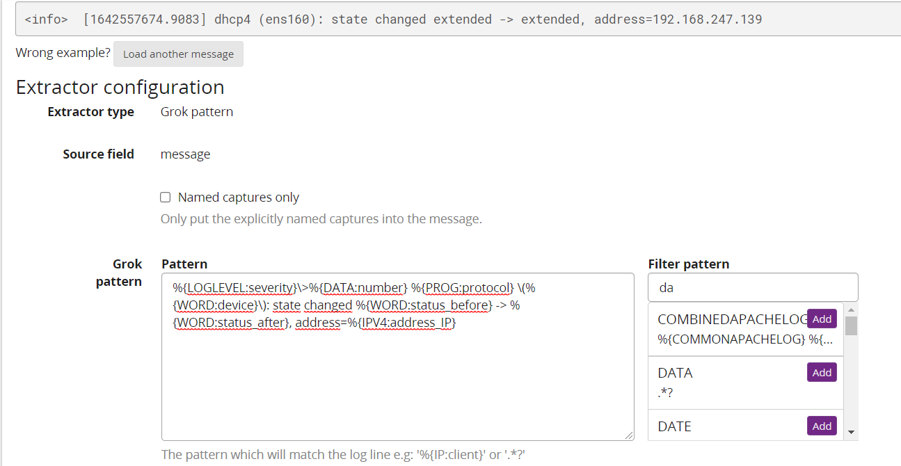
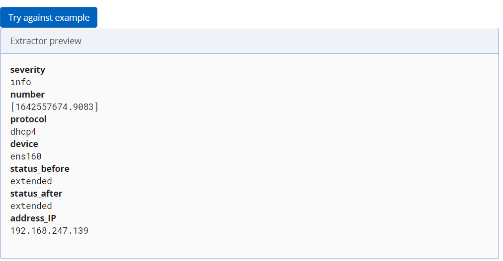

- Ví dụ 1
  - log

        [system] Activating via systemd: service name='org.freedesktop.  nm_dispatcher' unit='dbus-org.freedesktop.nm-dispatcher.service' requested by ':1.8' (uid=0 pid=1006 comm="/usr/sbin/NetworkManager --no-daemon " label="system_u:system_r:NetworkManager_t:s0")

  - grok pattern 

        %{WORD:level}]%{GREEDYDATA:status}: service name=%{GREEDYDATA:server_name} unit=%{GREEDYDATA:unit} requested by%{GREEDYDATA:requested_by}\((uid=%{BASE10NUM:uid} pid=%{BASE10NUM:pid}) comm=%{GREEDYDATA:comm} label=%{GREEDYDATA:label}\)

- Ví dụ 2 

  - log 
    
        <info>  [1642557674.9083] dhcp4 (ens160): state changed extended -> extended, address=192.168.247.139

 - grok pattern 

        %{LOGLEVEL:severity}\>%{DATA:number} %{PROG:protocol} \(%{WORD:device}\): state changed %{WORD:status_before} -> %{WORD:status_after}, address=%{IPV4:address_IP}

    

    