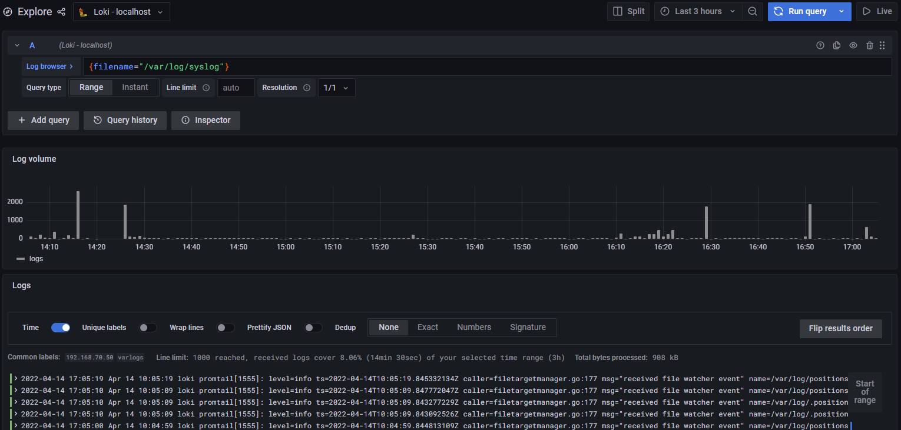

Triển khai Grafana Loki trên Ubuntu 20.04 


# 1. Mô hình   


# 2. IP planning


Name|	OS	|Interface	|IP	|Cấu hình phần cứng
----|----|----|----|----
loki|	Ubuntu 20.04	|enp1s0	|192.168.70.50|	Ram 2Gb, 2 core
|||enp2s0|10.10.1.50| 
VM-01 |	Ubuntu 20.04	|enp1s0	|192.168.70.51 |	Ram 2Gb, 2 core
|||enp2s0|10.10.1.52| 


# 3. Triển khai Grafana loki 
## 2.1 Nội dung 
- Installing Grafana
- Installing Grafana Loki
- Installing Promtail
- Configuring Loki data source

## 2.2 Installing Grafana

- Cập nhập hệ thống trước khi cài đặt 


      apt update
      apt upgrade -y

- Thêm Grafana GPG key

      apt-get install -y gnupg2 curl
      curl https://packages.grafana.com/gpg.key | sudo apt-key add -


- Thêm  Grafana APT repository

       apt install software-properties-common
       add-apt-repository "deb https://packages.grafana.com/oss/deb stable main"

- Cập nhập repo apt và cài đặt grafana      

      apt update && apt install -y grafana

- Start và enable grafana

      systemctl start grafana-server
      systemctl enable grafana-server

- Kiểm tra trạng thái grafana 

      systemctl status grafana-server


- Nếu firewall được bật cần cho phép port 3000 truy cập qua firewall 

      ufw allow proto tcp from any to any port 3000

## 2.3 Install Grafana Loki

- Loki dưới dạng file nhịn phân có thể tải xuống tại [tại đây](https://github.com/grafana/loki/releases/). 
- Tại xuống phiên bản cần dùng và lựa chọn kiến trúc cần cài đặt, ở đây tôi dùng phiên bản 2.5.0 và phiển bản dành cho linux amd64

      curl -LO https://github.com/grafana/loki/releases/download/v2.5.0/loki-linux-amd64.zip

- Giải nén file và di chuyển file đến thư mục `/usr/local/bin/loki`

      apt install -y unzip
      unzip loki-linux-amd64.zip
      mv loki-linux-amd64 /usr/local/bin/loki


- Tạo thư mục cấu hình và thêm file cấu hình cho  loki 

      mkdir /etc/loki
      mkdir -p /data/loki

- Thêm nội dung dưới đây vào file cấu hình  `/etc/loki/config.yaml`

```
auth_enabled: false

server:
  http_listen_port: 3100
  grpc_listen_port: 9096

common:
  path_prefix: /data/loki
  storage:
    filesystem:
      chunks_directory: /data/loki/chunks
      rules_directory: /data/loki/rules
  replication_factor: 1
  ring:
    instance_addr: 127.0.0.1
    kvstore:
      store: inmemory

schema_config:
  configs:
    - from: 2020-10-24
      store: boltdb-shipper
      object_store: filesystem
      schema: v11
      index:
        prefix: index_
        period: 24h
```
- Tạo service loki systemd  `/etc/systemd/system/loki.service`. và thêm nội dung 
```
[Unit]
Description=Loki service
After=network.target

[Service]
Type=simple
User=root

ExecStart=/usr/local/bin/loki -config.file /etc/loki/config.yaml

[Install]
WantedBy=multi-user.target
```
- Reload system deamon,  khởi động loki service và kiểm tra trạng thái loki
      
      systemctl daemon-reload
      systemctl start loki


-  Kiểm tra trạng thái loki

      systemctl status loki

  

- Truy cập `https://server-IP:3100/metrics` để xem chỉ số của loki 
## 2.4 Installing Promtail Agent
- Promtail dưới dạng file nhịn phân có thể tải xuống tại [tại đây](https://github.com/grafana/loki/releases/). 
- Tại xuống phiên bản cần dùng và lựa chọn kiến trúc cần cài đặt, ở đây tôi dùng phiên bản 2.5.0 và phiển bản dành cho linux amd64

      curl -LO https://github.com/grafana/loki/releases/download/v2.5.0/promtail-linux-amd64.zip

- Giải nén và chuyển thư mục đến  /usr/local/bin/promtail

      unzip promtail-linux-amd64.zip
      mv promtail-linux-amd64 /usr/local/bin/promtail


- Tạo thư mục cấu hình và thư mục data cho Promtail 

      mkdir /etc/promtail
      mkdir -p /data/promtail

- Tạo file cấu  hình YAML và thêm nội dung 

      vim /etc/promtail/config.yaml

Nội dung 

```
server:
  http_listen_port: 9080
  grpc_listen_port: 0

positions:
  filename: /data/promtail/positions.yaml

clients:
  - url: http://127.0.0.1:3100/loki/api/v1/push

scrape_configs:
- job_name: system
  static_configs:
  - targets:
      - localhost
    labels:
      job: varlogs
      __path__: /var/log/*log
- job_name: grafanalogs
  static_configs:
  - targets:
      - localhost
    labels:
      job: grafana
      __path__: /var/log/grafana/grafana.log
```

- Tạo systemd service để quản lý promtail service 

```
sudo tee /etc/systemd/system/promtail.service<<EOF
[Unit]
Description=Promtail service
After=network.target

[Service]
Type=simple
User=root
ExecStart=/usr/local/bin/promtail -config.file /etc/promtail/config.yaml

[Install]
WantedBy=multi-user.target
EOF
```
- Reload và khởi động Promtail service 

      systemctl daemon-reload
      systemctl start promtail.service
- Kiểm tra trạng thái Promtail service 

      systemctl status promtail
  

## 2.5 Cấu hình data Source

- Truy cập Web UI của grafana `IP-service:3000`, 

Nhập thông tin đăng nhập sau đó thay đổi passwork mới

      user: admin
      password: admin 


  
  

### Cầu hình nhận log từ localhost
- Chọn  Configuration -> Data Sources -> Add data source.
  

- Chọn Loki 
  

- Điền thông tin
  - Name: tên của instance
  - URL: địa chỉ client cần thu log và port sử dụng 
  

  - Chọn  Save & test

 - Chọn  Explore -> Log browers -> chọn lable -> Show logs để xem log  

   
   

### Cấu hình nhận log từ client 
- Tại VM-01 cài đặt [loki](#23-install-grafana-loki)

- Tại VM-01 cài đặt [Promtail service](#24-installing-promtail-agent)

- Chọn  Configuration -> Data Sources -> Add data source.
  

- Chọn Loki 
  

- Điền thông tin
  - Name: tên của instance
  - URL: địa chỉ client cần thu log và port sử dụng 
  

  - Chọn  Save & test

 - Chọn  Explore -> Log browers -> chọn lable -> Show logs để xem log  

   
   


# Tham khảo 
- https://citizix.com/how-to-setup-promtail-grafana-and-loki-for-free-log-management-in-debian-11/
- https://github.com/grafana/loki
- https://github.com/grafana/loki/blob/main/docs/sources/configuration/examples.md
- https://computingforgeeks.com/forward-logs-to-grafana-loki-using-promtail/