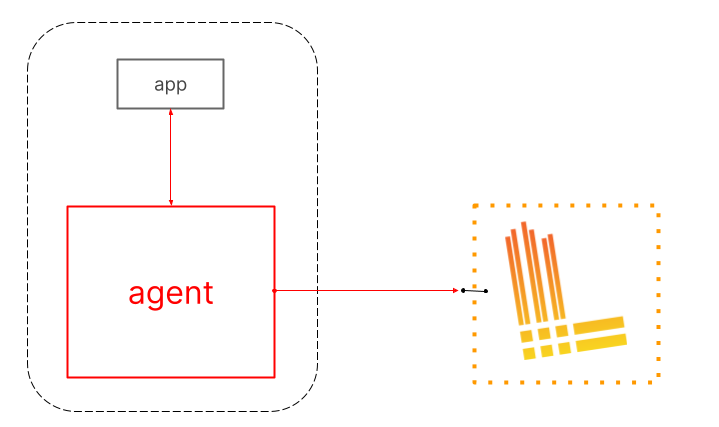

# 1 Grafana Loki
## 1.1 Loki
- **Loki** là hệ thống log tập trung được thiết kế từ Prometheus, có tính sẵn sàng cao ( high-available) và có khả năng scale. Nó được thiết kế để dễ  dàng vận hành và hiệu quả về chi phí. Nó không index nội dung log, nhưng mỗi nhãn (label) là 1 luồng log. 
- Dự án Loki đã được bắt đầu tại Grafana Labs vào năm 2018 và được công bố tại KubeCon Seattle. Loki được phát hành theo giấy phép AGPLv3.
- Loki giống như Prometheus, sử dụng nhẫn để lập chỉ mục dữ liệu, nhưng cho log. Điều này cho phép Loki lưu trữ các chỉ mục với dung lượng ít hơn. Hơn nữa thiết kế của Loki hoàn toàn tương thích với Prometheus, cho phép các nhà phát triển áp dụng các tiêu chí nhãn giống nhau trên hai nền tảng.
-  Loki khác với Prometheus bằng cách tập trung vào log thay vì metric và cung cấp log thông qua push, thay vì pull.
- Loki tương tự như ELK/EFK stack, nhưng thiết lập và sử dụng nhanh hơn và có nhiều tính năng hơn.
- Loki lập chỉ mục các timestamps và một tập hợp các nhãn cho luồng log chứ không phải nội dung của log. Nó làm giảm kích thước chỉ mục, giúp đơn giản hóa các quy trình và do đó, cắt giảm chi phí.
- So sánh với hệ thống log khác, loki: 
  - Không index fulltext log. Lưu trữ với thuật toán nén, không có cấu trúc log, chỉ index medata. Loki dễ dàng vận hành và chỉ cần resource nhỏ là có thể chạy.
  - Index và group các luồng log stream dựa vào các nhãn giống nhau.
  - Đặc biệt rất phù hợp với lưu trữ log của các Pod chạy trong Kubernetes. Metadata đánh nhãn trong Pod để auto scraped.
  - Support với Grafana v6.0 trở lên.

- Lợi ích của việc sử dụng loki
  - **Dễ sử dụng**: Cài đặt đơn giản và dễ vận hành.

  - **Trọng lượng nhẹ**: Nó chỉ lập chỉ mục siêu dữ liệu thay vì thông báo log đầy đủ như EFK đang làm. Điều này dẫn đến các phiên bản RAM ít tốn kém hơn cần thiết cho việc triển khai Loki.

  - **Cloud-native**: Nó hoạt động tốt cùng với các công cụ cloud-native khác như Kubernetes , nơi siêu dữ liệu như nhãn Pod được tự động thu thập và lập chỉ mục.

  -** Sử dụng Lưu trữ đối tượng**: Nó sử dụng lưu trữ đối tượng như Amazon S3 hoặc GCS, thường rẻ hơn so với lưu trữ khối.

  - **Quy mô theo chiều ngang**: Nó có thể chạy dưới dạng một tệp nhị phân duy nhất cục bộ hoặc cho các hoạt động quy mô nhỏ và có thể dễ dàng mở rộng theo chiều ngang cho các hoạt động quy mô lớn.

  - **Tính nhất quán số đại biểu** : Nó sử dụng tính nhất quán số đại biểu kiểu Dynamo cho các thao tác đọc và ghi để đảm bảo kết quả truy vấn đồng nhất.

  - **Hỗ trợ nhiều người thuê nhà**: Nó hỗ trợ nhiều người thuê nhà thông qua ID người thuê nhà để dữ liệu của người thuê nhà được lưu trữ riêng biệt.

  - **Hỗ trợ Grafana bản địa**: Nó có hỗ trợ bản địa trong Grafana (cần Grafana v6.0).

- Loki có 3 thành phần chính
  - **Promtail** là agent, có trách nhiệm đi thu gom log và gửi về cho Loki.
  - **Loki** là thành phần chính, có trách nhiệm lưu trữ log và xử lý truy vấn
  - **Grafana** là công cụ query và hiển thị log.

## 1.2 Grafana

- Grafana là một nền tảng open-source chuyên phục vụ mục đích theo dõi và đánh giá các số liệu thu được. 
- Grafana  xây dựng các analytics và monitoring
- Grafana là một giao diện/dashboard theo dõi hệ thống (opensource), hỗ trợ rất nhiều loại dashboard và các loại graph khác nhau để người quản trị dễ dàng theo dõi.
- Grafana có thể truy xuất dữ liệu từ Graphite, Elasticsearch, OpenTSDB, Prometheus và InfluxDB. Grafana là một công cụ mạnh mẽ để truy xuất và biểu diễn dữ liệu dưới dạng các đồ thị và biểu đồ.
- Grafana sẽ sử dụng metric thu thập được để phân tích và tạo ra dashboard mô tả trực quan các metric cần thiết cho việc monitoring ví dụ như cpu, ram, dish, network, iops, session.

## 1.3 Mục đính ra đời
- Grafana Loki được tạo ra để đáp ứng yêu cầu về một công cụ mã nguồn mở có thể dễ dàng chọn và kiểm tra log chuỗi thời gian được lưu giữ một cách ổn định. Các công nghệ trực quan hóa log với khả năng truy vấn, tổng hợp log và theo dõi log phân tán đều có thể giúp xác định các sự cố hệ thống.
- Các công cụ khắc phục sự cố mã nguồn mở hiện tại không dễ dàng tích hợp với Prometheus. Nó không cho phép các nhà phát triển tìm kiếm metadata của Prometheus trong một khoảng thời gian nhất định, thay vì giới hạn chúng trong các log gần đây nhất. Hơn nữa, việc lưu trữ log không hiệu quả, các nhà phát triển nhanh chóng đạt đến giới hạn ghi log của họ và phải quyết định log nào họ có thể sống mà không có. Việc làm hỏng một số công cụ có thể khiến log bị mất vĩnh viễn.
- Những giải pháp độc quyền trên thị trường không có những giới hạn này và cung cấp các tính năng vượt xa những gì mà các công cụ nguồn mở có thể cung cấp.
- Thay vì sử dụng một công cụ mã nguồn mở khác cho từng mục đích, các công nghệ này có thể kết hợp các tìm kiếm có giới hạn thời gian, tổng hợp log và truy tìm phân tán vào một công cụ duy nhất
# 2. Nguyên tắc cơ bản 
- Grafana Loki là một công cụ tổng hợp log và nó là cốt lõi của một fully-featured logging stack.
- Agent(client) thu thập các log và biến các log thành luồng và đẩy kường tới loki thông qua HTTP API.  Promtail agent được thiêt kế cho việc cài đặt loki, nhưng có nhiều agent tích hợp sẵn trong loki

- Loki lập chỉ mục các luồng, mỗi luồng xác định một tập  hợp các bản ghi được liên kết với một tập hợp nhãn duy nhất. Chất lượng nhãn là chìa khóa để tạo ra một index nhỏ gọn và cho phép truy vấn hiệu quả 

- LogQL là ngôn ngữ truy vấn cho loki
# 3. Tính năng

- **Efficient memory usage for indexing the logs**- Sử dụng bộ nhớ hiệu quả để lập chỉ mục nhật ký
  - Bằng cách lập chỉ mục trên một tập hợp các nhãn, inđex có thể nhỏ hơn đáng kể so với các sản phẩm tổng hợp log khác. Bộ nhớ ít hơn làm cho nó ít tốn kém hơn để hoạt động.
-  **Multi-tenancy** - Nhiều người thuê
  - Loki cho phép nhiều người thuê để tận dụng một loki duy nhất. Dữ liệu của nhưng người thuê hoàn toàn độc lập với nhau.  Multi-tenancy được cấu hình bằng cách gán một ID người thuê trong agent
- **LogQL, Loki’s query language** - LogQL ngôn ngữa của loki
  - Người dùng ngôn ngữ truy vấn Prometheus, PromQL, sẽ thấy LogQL quen thuộc và linh hoạt để tạo các truy vấn dựa trên log. Ngôn ngữ này cũng tạo điều kiện thuận lợi cho việc tạo số liệu từ dữ liệu log, một tính năng mạnh mẽ vượt xa việc tổng hợp log.
- **Scalability** - Khả năng mở rộng
  - Loki có thể chạy dưới dạng một file nhị phân duy nhất, tất cả các thành phần đều chạy trong một process
  - Loki được thiết kết cho khả năng mở rộng, mỗi một thành phần của loki có thể chạy dưới dạng microervices. Cấu hình cho phép mở rộng quy mô từng microservices, cho phép cài đặt quy mô lớn linh hoạt.
- **Flexibility** - Uyển chuyển 
  - Nhiều agent(client) có hỗ trợ plugin. Nó cho phép  observability structure hiện tại thêm loki như một công cụ tổng hợp log mà không cần chuyển đổi các phần hiện có của  observability stack.
- **Grafana integration** - Tích hợp Grafana
  - Loki tích hợp liền mạch với Grafana, cung cấp một observability stack hoàn chỉnh.

# 4. Kiến trúc 

