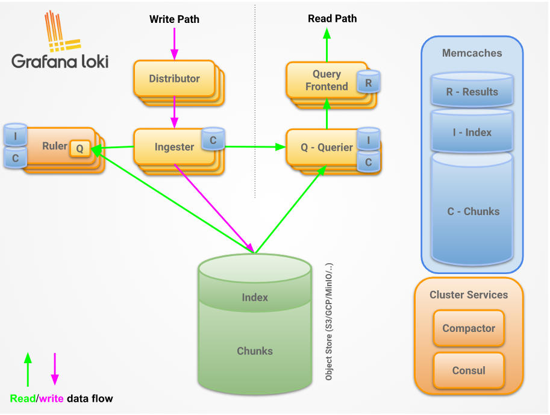
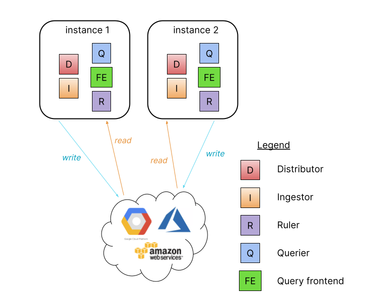
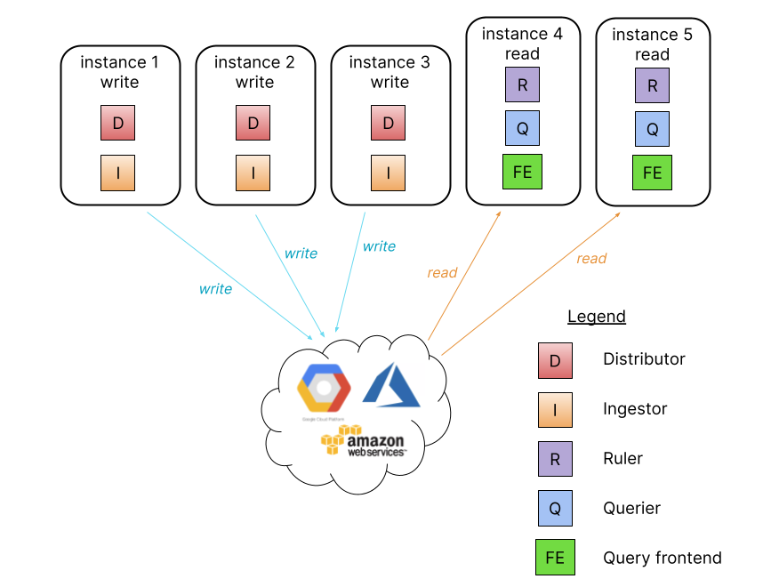
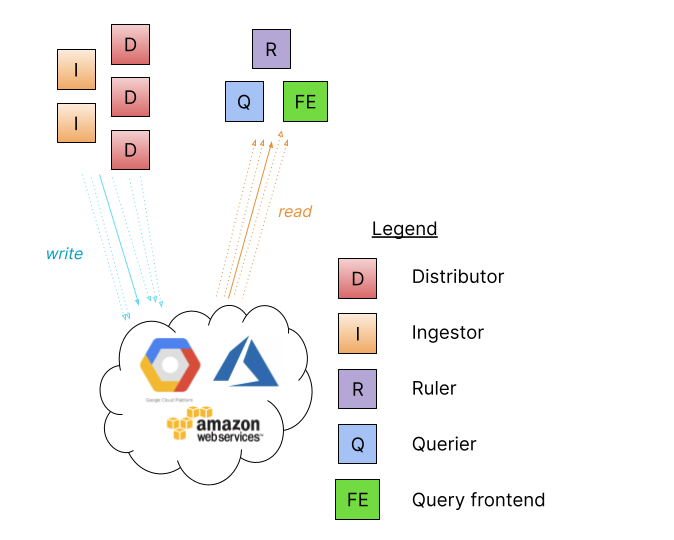
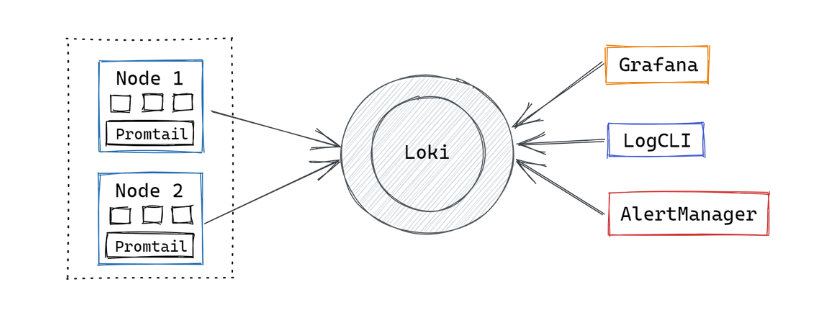

# Mục lục
- [1. Grafana Loki](#1)
  - [1.1Loki](#11)
  - [1.2 Grafana](#12)
  - [1.3 Mục đính ra đời](#13)
- [2. Nguyên tắc cơ bản](#2)
- [3. Tính năngn](#3)
- [4. Kiến trúc](#4)
  - [4.1 Thành phần](#41)
  - [4.2 Các chế độ triển khai](#42)
- [5. Hoạt động của Grafana Loki](#5)

- [Tham khảo](#tm)
 

# 1. Grafana Loki

## 1.1 Loki
- **Loki** là hệ thống log tập trung được thiết kế từ Prometheus, có tính sẵn sàng cao ( high-available) và có khả năng scale. Nó được thiết kế để dễ  dàng vận hành và hiệu quả về chi phí. Nó không lập chỉ mục  nội dung log, nhưng mỗi nhãn (label) là 1 luồng log. 
- Dự án Loki đã được bắt đầu tại Grafana Labs vào năm 2018 và được công bố tại KubeCon Seattle. Loki được phát hành theo giấy phép AGPLv3.
- Loki giống như Prometheus, sử dụng nhẫn để lập chỉ mục dữ liệu, nhưng cho log. Điều này cho phép Loki lưu trữ các chỉ mục với dung lượng ít hơn. Hơn nữa thiết kế của Loki hoàn toàn tương thích với Prometheus, cho phép các nhà phát triển áp dụng các tiêu chí nhãn giống nhau trên hai nền tảng.
-  Loki khác với Prometheus bằng cách tập trung vào log thay vì metric và cung cấp log thông qua push, thay vì pull.
- Loki tương tự như ELK/EFK stack, nhưng thiết lập và sử dụng nhanh hơn và có nhiều tính năng hơn.
- Loki lập chỉ mục các timestamps và một tập hợp các nhãn cho luồng log chứ không phải nội dung của log. Nó làm giảm kích thước chỉ mục, giúp đơn giản hóa các quy trình và do đó, cắt giảm chi phí.
- So sánh với hệ thống log khác, loki: 
  - Không index fulltext log. Lưu trữ với thuật toán nén, không có cấu trúc log, chỉ lập chỉ mục  metadata. Loki dễ dàng vận hành và chỉ cần resource nhỏ là có thể chạy.
  - Index và group các luồng log stream dựa vào các nhãn giống nhau.
  - Đặc biệt rất phù hợp với lưu trữ log của các Pod chạy trong Kubernetes. Metadata đánh nhãn trong Pod để auto scraped.
  - Support với Grafana v6.0 trở lên.

### Lợi ích của việc sử dụng loki
  - **Dễ sử dụng**: Cài đặt đơn giản và dễ vận hành.

  - **Trọng lượng nhẹ**: Nó chỉ lập chỉ mục siêu dữ liệu thay vì thông báo log đầy đủ như EFK đang làm. Điều này dẫn đến các phiên bản RAM ít tốn kém hơn cần thiết cho việc triển khai Loki.

  - **Cloud-native**: Nó hoạt động tốt cùng với các công cụ cloud-native khác như Kubernetes , nơi siêu dữ liệu như nhãn Pod được tự động thu thập và lập chỉ mục.

  - **Sử dụng Lưu trữ đối tượng**: Nó sử dụng lưu trữ đối tượng như Amazon S3 hoặc GCS, thường rẻ hơn so với lưu trữ khối.

  - **Quy mô theo chiều ngang**: Nó có thể chạy dưới dạng một tệp nhị phân duy nhất cục bộ hoặc cho các hoạt động quy mô nhỏ và có thể dễ dàng mở rộng theo chiều ngang cho các hoạt động quy mô lớn.

  - **Tính nhất quán số đại biểu** : Nó sử dụng tính nhất quán số đại biểu kiểu Dynamo cho các thao tác đọc và ghi để đảm bảo kết quả truy vấn đồng nhất.

  - **Hỗ trợ nhiều người thuê**: Nó hỗ trợ nhiều người thuê thông qua ID người thuê để dữ liệu của người thuê được lưu trữ riêng biệt.

  - **Hỗ trợ Grafana bản địa**: Nó có hỗ trợ bản địa trong Grafana (cần Grafana v6.0).

### Một stack ghi log dựa trên Loki có 3 thành phần chính
  - **Promtail** là một tác nhân cần được cài đặt trên mỗi nút đang chạy các ứng dụng hoặc dịch vụ của bạn. Nó phát hiện các mục tiêu (chẳng hạn như các tệp log cục bộ), gắn nhãn vào các luồng log từ các vỏ và gửi chúng đến Loki.
  - **Loki** là thành phần chính, có trách nhiệm lưu trữ log và xử lý truy vấn
  - **Grafana** là một nền tảng trực quan mã nguồn mở xử lý dữ liệu chuỗi thời gian từ Loki và làm cho các log có thể truy cập được trong giao diện người dùng web.
### Một số trường hợp sử dụng loki
  - **Gỡ lỗi và khắc phục sự cố**: Loki giúp các nhóm DevOps đi đến tận cùng của vấn đề nhanh hơn bằng cách cung cấp thông tin hữu ích liên quan đến vấn đề đang xử lý. Ví dụ, có thể dễ dàng biết khi nào một vấn đề phát sinh, chính xác thì điều gì đã xảy ra và vấn đề xảy ra như thế nào.
  - **Giám sát**: Prometheus được sử dụng rộng rãi trong ngành công nghiệp để giám sát. Tuy nhiên, bạn có thể xác định nhiều vấn đề bằng cách theo dõi log của mình với Loki. Ví dụ: bạn có thể sử dụng nó để theo dõi tỷ lệ lỗi trên trang web của mình và nhận cảnh báo bất cứ khi nào vượt quá ngưỡng nhất định.
  - **An ninh mạng**: Loki cho phép bạn xác định các mối đe dọa, sự cố và hoạt động độc hại trong hệ thống của công ty bạn. Hơn nữa, nó giúp bạn hiểu chi tiết về một cuộc tấn công sau khi hệ thống đã bị xâm nhập. 
  - **Tuân thủ**: Khi các quy định yêu cầu các công ty phải lưu giữ log kiểm toán, Loki là một lựa chọn đáng tin cậy và an toàn để làm điều đó.
  - **Business Intelligence**: Loki giúp các nhóm không chuyên về kỹ thuật hiểu dữ liệu log và phát triển các chiến lược và ý tưởng mới để tăng trưởng kinh doanh. Ví dụ: các nhà tiếp thị có thể sử dụng dữ liệu để tối ưu hóa tỷ lệ chuyển đổi: họ có thể xem khách hàng đến từ đâu, kênh tiếp thị nào đang hoạt động tốt nhất và kênh nào cần được cải thiện.

## 1.2 Grafana

- Grafana là một nền tảng open-source chuyên phục vụ mục đích theo dõi và đánh giá các số liệu thu được. 
- Grafana  xây dựng các analytics và monitoring
- Grafana là một giao diện/dashboard theo dõi hệ thống (opensource), hỗ trợ rất nhiều loại dashboard và các loại graph khác nhau để người quản trị dễ dàng theo dõi.
- Grafana có thể truy xuất dữ liệu từ Graphite, Elasticsearch, OpenTSDB, Prometheus và InfluxDB. Grafana là một công cụ mạnh mẽ để truy xuất và biểu diễn dữ liệu dưới dạng các đồ thị và biểu đồ.
- Grafana sẽ sử dụng metric thu thập được để phân tích và tạo ra dashboard mô tả trực quan các metric cần thiết cho việc monitoring ví dụ như cpu, ram, dish, network, iops, session.

## 1.3 Mục đính ra đời
- Grafana Loki được tạo ra để đáp ứng yêu cầu về một công cụ mã nguồn mở có thể dễ dàng chọn và kiểm tra log chuỗi thời gian được lưu giữ một cách ổn định. Các công nghệ trực quan hóa log với khả năng truy vấn, tổng hợp log và theo dõi log phân tán đều có thể giúp xác định các sự cố hệ thống.
- Các công cụ khắc phục sự cố mã nguồn mở hiện tại không dễ dàng tích hợp với Prometheus. Nó không cho phép các nhà phát triển tìm kiếm metadata của Prometheus trong một khoảng thời gian nhất định, thay vì giới hạn chúng trong các log gần đây nhất. Hơn nữa, việc lưu trữ log không hiệu quả, các nhà phát triển nhanh chóng đạt đến giới hạn ghi log của họ và phải quyết định log nào họ có thể sống mà không có. Việc làm hỏng một số công cụ có thể khiến log bị mất vĩnh viễn.
- Những giải pháp độc quyền trên thị trường không có những giới hạn này và cung cấp các tính năng vượt xa những gì mà các công cụ nguồn mở có thể cung cấp.
- Thay vì sử dụng một công cụ mã nguồn mở khác cho từng mục đích, các công nghệ này có thể kết hợp các tìm kiếm có giới hạn thời gian, tổng hợp log và truy tìm phân tán vào một công cụ duy nhất.

# 2. Nguyên tắc cơ bản 
- Grafana Loki là một công cụ tổng hợp log và nó là cốt lõi của một fully-featured logging stack.
- Agent(client) thu thập các log và biến các log thành luồng và đẩy kường tới loki thông qua HTTP API.  Promtail agent được thiêt kế cho việc cài đặt loki, nhưng có nhiều agent tích hợp sẵn trong loki

- Loki lập chỉ mục các luồng, mỗi luồng xác định một tập  hợp các bản ghi được liên kết với một tập hợp nhãn duy nhất. Giá trị nhãn là chìa khóa để tạo ra một index nhỏ gọn và cho phép truy vấn hiệu quả. 

- LogQL là ngôn ngữ truy vấn cho loki

# 3. Tính năng

- **Efficient memory usage for indexing the logs**- Sử dụng bộ nhớ hiệu quả để lập chỉ mục nhật ký
  - Bằng cách lập chỉ mục trên một tập hợp các nhãn, inđex có thể nhỏ hơn đáng kể so với các sản phẩm tổng hợp log khác. Bộ nhớ ít hơn làm cho nó ít tốn kém hơn để hoạt động.
-  **Multi-tenancy** - Nhiều người thuê
  - Loki cho phép nhiều người thuê để tận dụng một loki duy nhất. Dữ liệu của nhưng người thuê hoàn toàn độc lập với nhau.  Multi-tenancy được cấu hình bằng cách gán một ID người thuê trong agent
- **LogQL, Loki’s query language** - LogQL ngôn ngữa của loki
  - Người dùng ngôn ngữ truy vấn Prometheus, PromQL, sẽ thấy LogQL quen thuộc và linh hoạt để tạo các truy vấn dựa trên log. Ngôn ngữ này cũng tạo điều kiện thuận lợi cho việc tạo số liệu từ dữ liệu log, một tính năng mạnh mẽ vượt xa việc tổng hợp log.
- **Scalability** - Khả năng mở rộng
  - Loki có thể chạy dưới dạng một file nhị phân duy nhất, tất cả các thành phần đều chạy trong một process
  - Loki được thiết kết cho khả năng mở rộng, mỗi một thành phần của loki có thể chạy dưới dạng microervices. Cấu hình cho phép mở rộng quy mô từng microservices, cho phép cài đặt quy mô lớn linh hoạt.
- **Flexibility** - Uyển chuyển 
  - Nhiều agent(client) có hỗ trợ plugin. Nó cho phép  observability structure hiện tại thêm loki như một công cụ tổng hợp log mà không cần chuyển đổi các phần hiện có của  observability stack.
- **Grafana integration** - Tích hợp Grafana
  - Loki tích hợp liền mạch với Grafana, cung cấp một observability stack hoàn chỉnh.

# 4. Kiến trúc 

## 4.1 Thành phần 
- Dịch vụ của Loki được tạo bằng cách sử dụng một tập hợp các thành phần (hoặc mô-đun)
-  Distributor, ingester, querier, and query frontend là 4 thành phần có thể truy cập để sử dụng

- **Distributor**
  - Distributor service chịu trách nhiệm xử lý các luồng đến của client. Đó là điểm dừng đầu tiên trong đường dẫn ghi data log. Sau khi Distributor nhận được một tập hợp các luồng, mỗi luồng sẽ được xác nhận tính đúng đắn và đảm bảo rằng nó nằm trong giới hạn đối tượng thuê đã định cấu hình (hoặc toàn cầu). Các phần hợp lệ sau đó được chia thành nhiều đợt và gửi song song cho ingesters.
  - Cần có bộ cân bằng tải đặt trước distributor để cân bằng lưu lượng truy cập đến môt cách hợp lý  
  - Distributor là thành phần không trạng thái . Nó giúp dễ dàng mở rộng quy mô và giảm tải công việc từ ingesters. Điều này cũng giúp Loki  có thể tự bảo vệ mình trước các cuộc tấn công từ chối dịch vụ (có thể là độc hại hoặc không) có thể gây quá tải cho ingesters
- **Ingester**
  - Ingester service chịu trách nhiệm ghi data log vào các chương trình phụ trợ lưu trữ dài hạn (DynamoDB, S3, Cassandra, v.v.) trên đường dẫn ghi và trả về data log cho các truy vấn trong bộ nhớ trên đường dẫn đọc.
  - Các trạng thái của ingester: 
    -  *PENDING* đang chờ sự chuyển giao từ một ingester khác là LEAVING
    - *JOINING* ingester đang chèn mã thông báo của mình vào vòng và tự khởi tạo. Nó có thể nhận được yêu cầu viết cho các mã thông báo mà nó sở hữu
    - *ACTIVE* ingester được khởi chạy hoàn toàn. Nó có thể nhận được cả yêu cầu ghi và đọc cho các mã thông báo mà nó sở hữu.
    - *LEAVING* ingester ngừng hoạt động, nó có thể nhận được yêu cầu đọc đối với dữ liệu mà nó vẫn còn trong bộ nhớ.
    - *UNHEALTHY* ingester thất bại trong heartbeat đến Consul. UNHEALTHY được nhà phân phối đặt khi kiểm tra định kỳ vòng.
- **Query frontend**
  - Query frontend là một dịch vụ tùy chọn cung cấp điểm cuối API của hàng đợi và có thể được sử dụng để tăng tốc đường dẫn đọc
  - Khi giao diện người dùng truy vấn được đặt, các yêu cầu truy vấn đến phải được chuyển hướng đến giao diện người dùng truy vấn thay vì queriers. Dịch vụ truy vấn sẽ vẫn được yêu cầu trong cụm, để thực hiện các truy vấn thực tế.
- **Querier**
  - Querier service xử lý truy vấn sử dụng ngôn gnữ truy vấn LogQL, 
tìm nạp nhật ký cả từ ingesters và từ bộ lưu trữ dài hạn.
  - Queriers truy vấn tất cả ingesters cho in-memory data trước khi chạy trở lại cùng một truy vấn với của hàng phụ trợ

## 4.2 Các chế độ triển khai 
### Monolithic mode
- Phương thức hoạt động đơn giản nhất là `-target=all`. Đây là target mặc định. Nó chạy tất cả các thành phần microservice của Loki bên trong một process duy nhất dưới dạng một image nhị phân hoặc image Docker.

- Monolithic mode thích hợp để chạy thử nhiệm với khối lượng đọc ghi sấp xỉ 100GB/ngày 

- Cấu hình `memberlist_config section` sử dụng để chia sẻ trạng thái giữa tất cả instances
- High availability có thể cấu hình bằng cách chạy 2 loki instances sử dụng cấu hình  `memberlist_config` và chia sẻ object store.
- Định tuyến lưu lượng truy cập đến tất cả các Loki instances theo kiểu quay vòng.
- Song song hóa truy vấn được giới hạn ở số lượng phiên bản và tính song song của truy vấn được xác định.
### Simple scalable deployment mode
- Sử dụng khi lượng log vượt quá vài trăm GB/ngày hoặc muốn tách biệt giữa đọc và ghi
- Chế độ triển khai này có thể mở rộng đến vài TB nhật ký mỗi ngày và hơn thế nữa.

- Trong chế độ này, các microservices của Loki được gộp thành hai target: `-target = read` và `-target = write`. Dịch vụ máy nén BoltDB sẽ chạy như một phần của mục tiêu đọc.
- Ưu điểm khi tách read và write
  - Tính khả dụng cao hơn của đường dẫn ghi bằng cách cung cấp các nút chuyên dụng
  - Đường dẫn đọc có thể mở rộng riêng biệt để thêm / xóa hiệu suất truy vấn theo yêu cầu

- Simple scalable deployment mode yêu cầu một bộ cân bằng tải phía trước Loki, `/loki/api/v1/push` lưu lượng truyền đến các nút ghi. Tất cả các yêu cầu khác chuyển đến các nút đã đọc. Lưu lượng truy cập phải được gửi theo kiểu vòng tròn.
### Microservices mode
- Chế độ triển khai microservices khởi tạo các thành phần của Loki dưới dạng các quy trình riêng biệt. Mỗi quy trình được gọi chỉ định `target`: 
  - ingester
  - distributor
  - query-frontend
  - query-scheduler
  - querier
  - index-gateway
  - ruler
  - compactor

- Sử dụng chế độnày cho phép mửo rộng quy mô bằng cách tăng số lưuọng microservice. Cụm tùy chỉnh cho phép khản năng quan sát tốt hơn các thành phần riêng lẻ 
- Đây là chế độ hoạt động hiệu quả nhất nhưng cũng phức tạp cho việc thiết lập và bảo trì 

# 5. Hoạt động của Grafana Loki

1. Pull Logs with Promtail
- Promtail là một công cụ thu thập log chỉ dành cho Loki. Nó sử dụng cùng một khám phá dịch vụ Prometheus và có các tính năng tương tự để gắn thẻ, chuyển đổi và lọc nhật ký trước khi nhập vào Loki.
2. Store Logs in Loki 
- Nội dung log không được loki lập chỉ mục. Các mục sẽ được phân loại thành các luồng và được gán nhãn. Nó không chỉ giúp tiết kiệm tiền mà còn có nghĩa là các dòng log có thể truy vấn được truy vấn trong vòng mini giây kể từ khi loki nhận được. 
3. Use LogQL to Explore
- Để khám phá nhật ký của bạn, hãy sử dụng ngôn ngữ truy vấn nâng cao của Loki, LogQL. Chạy các truy vấn LogQL từ bên trong Grafana để xem nhật ký của bạn cùng với các nguồn dữ liệu khác hoặc sử dụng LogCLI nếu bạn thích dòng lệnh.
4. Alert Logs
- Thiết lập các quy tắc cảnh báo để Loki sử dụng trong khi đánh giá dữ liệu nhật ký của bạn. Định cấu hình Loki để truyền các cảnh báo được tạo đến Prometheus Alertmanager, nơi chúng sẽ được chuyển đến nhóm thích hợp.
#  Tham Khảo
- https://grafana.com/docs/loki/latest/fundamentals/architecture/deployment-modes/
- https://www.atatus.com/blog/a-beginners-guide-for-grafana-loki/

